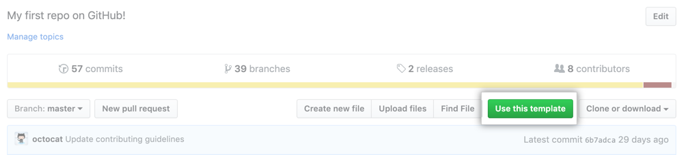

# Small Guide to use this template.

### Creating your own repo

You can generate a new repository with the same directory structure as this one. On the main page of the repository, click on **Use this template**, and follow the steps to create a new repository. You may read [this](https://docs.github.com/en/repositories/creating-and-managing-repositories/creating-a-repository-from-a-template) for further information.

> You may set your repo as `private`. In this case, you may add your advisor as a contributor.

### Updating your own repo

- As you may have noticed, the documents are using [MarkDown](https://www.markdownguide.org/). for the sake of organization, we strongly encourage you to keep using it.

- There is no automatic update for the main page. **You must to add each new entry manually**.

- In the first example, we used the date for the meeting log name. You can change it for something more appropriate for you.

- Best practice: commit and push after each meeting.

- There is a folder to keep the images. If you need, you can use it on your logs as well.

- > ### Do NOT fork or pull-request the template repo.

[Back](../README.md)
